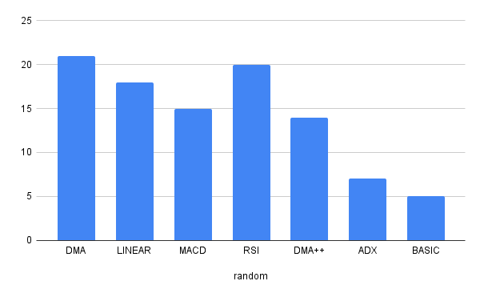
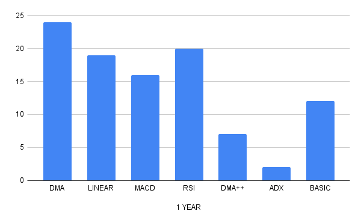
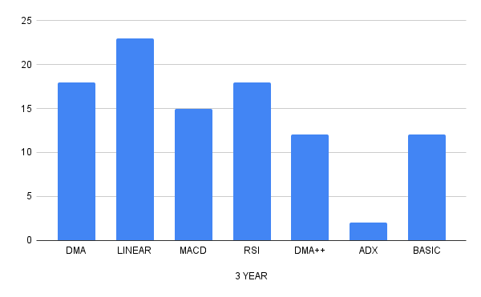
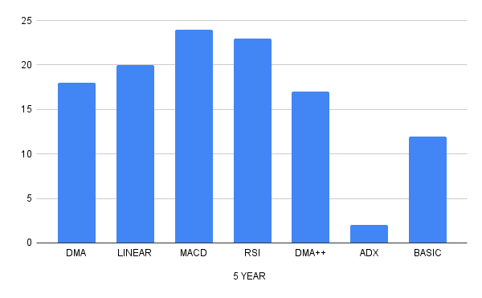
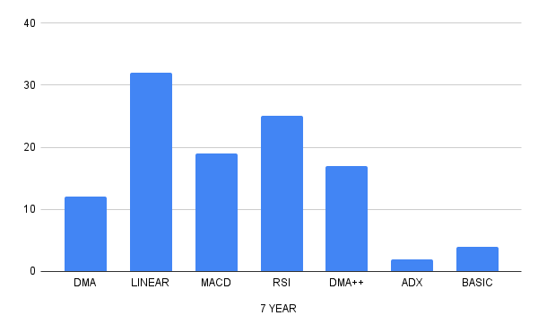
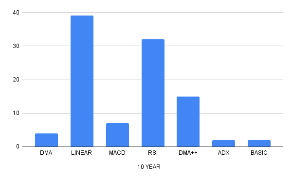

Assignment 1, Final Task, COP290
Anup Lal Nayak - 2022CS51827
Lucky Ahirwar  - 2022CS52049

As observed by the BEST_OF_ALL strategy for random start and end dates 
over a big sample space using multiple stock's data the following was observed :

Plot : times won out of 100 vs type of strategy

    timeframe = start_date - end_date;

Over avg timeframe of 1 year:

Over avg timeframe of 3 years:

Over avg timeframe of 5 years:

Over avg timeframe of 7 years:

Over avg timeframe of 10 years:

Over timeframes:

Results:

    7 Year to 10 Years:
        In this range, the linear regression model consistently provided the best results.
        This was followed by RSI.

    3-5 Years:
        Within this time frame, the combination of RSI and DMA yielded the best results.
        Discuss the rationale behind RSI and DMA being effective in medium-term trading, such as their ability to identify overbought or oversold conditions and trend reversals.
        Linear regression and MACD were the next best as per results.

    

Discussion:
The observed performance of trading strategies can be attributed to several factors, including market trends, volatility, and the sensitivity of indicators to market noise. Linear regression's consistent performance over longer time horizons suggests its robustness in capturing fundamental market trends. RSI and DMA's effectiveness in medium-term trading underscores the importance of identifying market sentiment and trend dynamics. However, it's crucial to note that no single strategy guarantees success, and traders must adapt their strategies to changing market conditions.

Conclusion:
In conclusion, our analysis highlights the importance of selecting appropriate trading strategies based on the desired time horizon. While linear regression excels in capturing long-term trends, RSI and DMA offer valuable insights for medium-term trading. MACD remains a viable option but may require additional considerations depending on market conditions. Traders and investors should carefully evaluate the performance of different strategies and tailor their approach to suit their investment objectives and risk tolerance. Further research into refining trading strategies and assessing their performance under various market conditions is warranted.

References:
wikipedia

4.1

